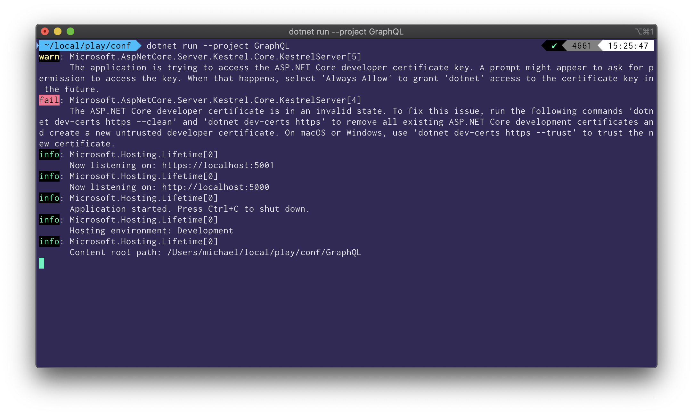
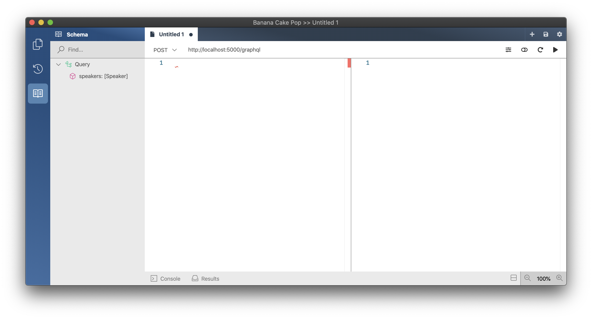
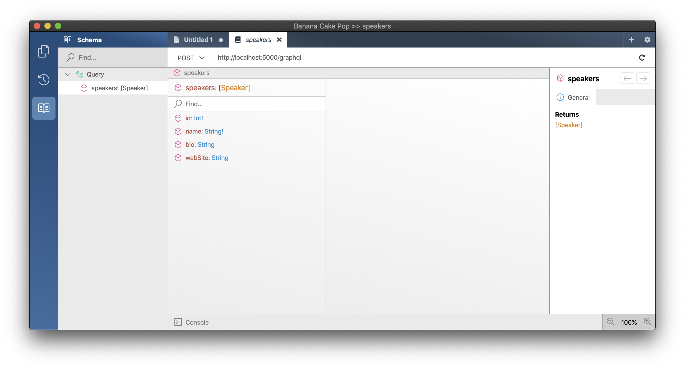
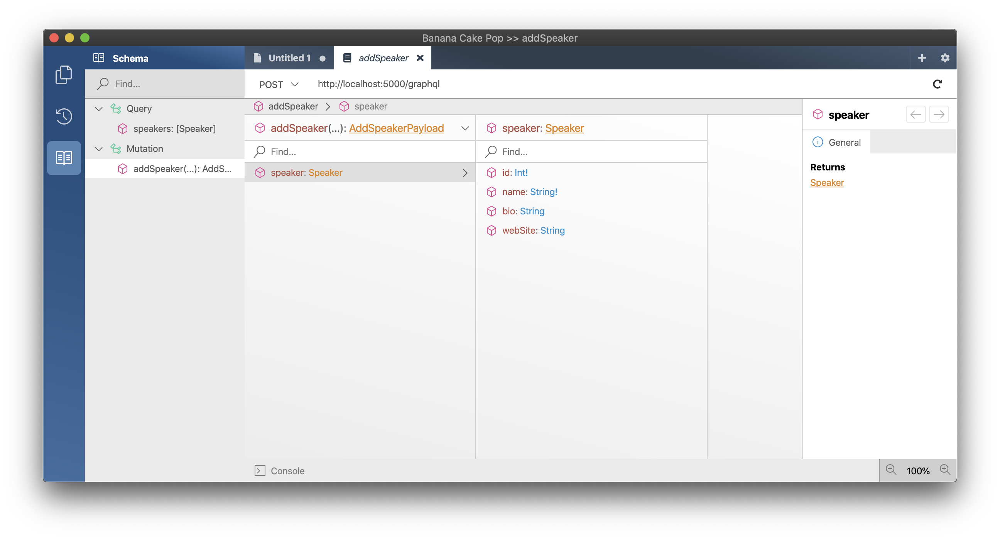
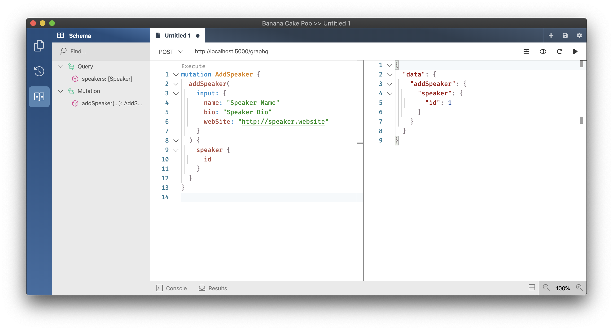
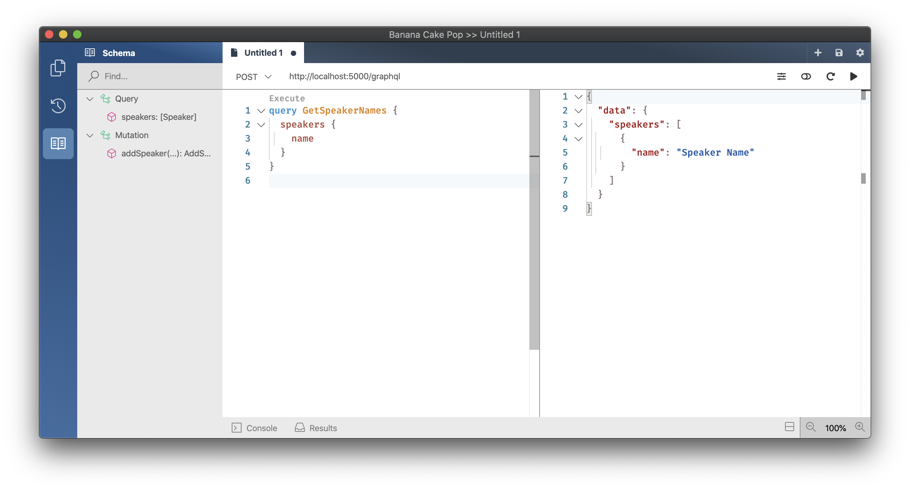
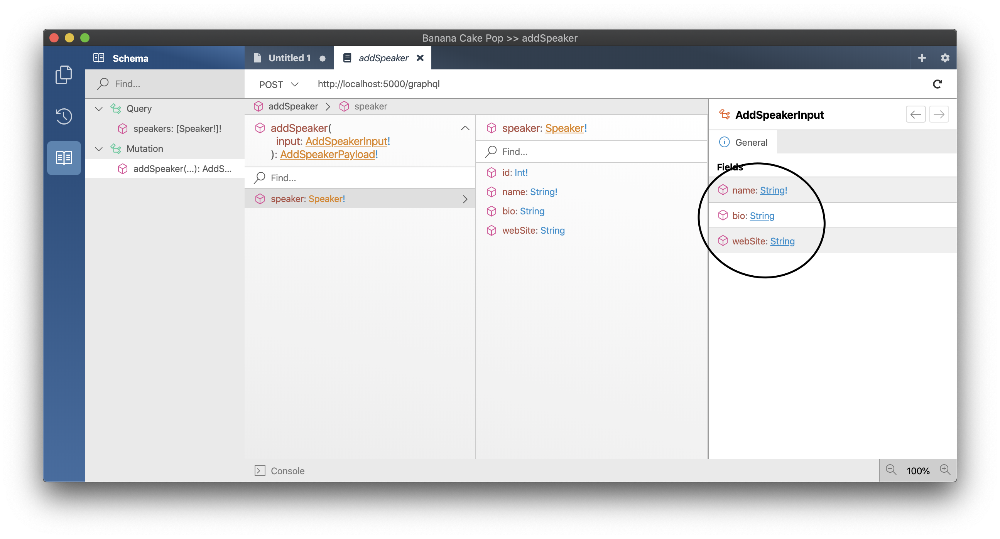

- [Create a new GraphQL server project](#create-a-new-graphql-server-project)
  - [Register the DB Context Service](#register-the-db-context-service)
  - [Configuring EF Migrations](#configuring-ef-migrations)
    - [Option 1 - Visual Studio: Package Manager Console](#option-1---visual-studio-package-manager-console)
    - [Option 2 - Command line](#option-2---command-line)
  - [Adding GraphQL](#adding-graphql)
  - [Adding Mutations](#adding-mutations)
  - [Configure Nullability](#configure-nullability)
  - [Summary](#summary)

# Create a new GraphQL server project

1. Create a new project for our GraphQL Server.
   1. `dotnet new sln -n ConferencePlanner`
   1. `dotnet new web -n GraphQL`
   1. `dotnet sln add GraphQL`
1. Add a new folder `Data` where we want to place all our database related code.
   1. `mkdir GraphQL/Data`
1. Add a new file `Speaker.cs` in the `Data` directory using the following code:

   ```csharp
   using System.ComponentModel.DataAnnotations;

   namespace ConferencePlanner.GraphQL.Data
   {
       public class Speaker
       {
           public int Id { get; set; }

           [Required]
           [StringLength(200)]
           public string Name { get; set; }

           [StringLength(4000)]
           public string Bio { get; set; }

           [StringLength(1000)]
           public virtual string WebSite { get; set; }
       }
   }
   ```

1. Add a reference to the NuGet package package `Microsoft.EntityFrameworkCore.Sqlite` version `6.0.0`.
   1. `dotnet add GraphQL package Microsoft.EntityFrameworkCore.Sqlite --version 6.0.0`
1. Next we'll create a new Entity Framework DbContext. Create a new `ApplicationDbContext` class in the `Data` folder using the following code:

   ```csharp
   using Microsoft.EntityFrameworkCore;

   namespace ConferencePlanner.GraphQL.Data
   {
       public class ApplicationDbContext : DbContext
       {
           public ApplicationDbContext(DbContextOptions<ApplicationDbContext> options)
               : base(options)
           {
           }

           public DbSet<Speaker> Speakers { get; set; }
       }
   }
   ```

## Register the DB Context Service

1. Replace the code in `Programm.cs` with the following code:

   ```csharp
    using ConferencePlanner.GraphQL.Data;
    using Microsoft.EntityFrameworkCore;

    var builder = WebApplication.CreateBuilder(args);
    builder.Services.AddDbContext<ApplicationDbContext>(options => options.UseSqlite("Data Source=conferences.db"));

    var app = builder.Build();

    app.UseRouting();

    app.Run();
   ```

   > This code registers the `ApplicationDbContext` service so it can be injected into resolvers.

## Configuring EF Migrations

1. Add a reference to the NuGet package `Microsoft.EntityFrameworkCore.Tools` version `6.0.0`.
   1. `dotnet add GraphQL package Microsoft.EntityFrameworkCore.Tools --version 6.0.0`

### Option 1 - Visual Studio: Package Manager Console

1. In Visual Studio, select the Tools -> NuGet Package Manager -> Package Manager Console

1. Run the following commands in the Package Manager Console

   ```console
   Add-Migration Initial
   Update-Database
   ```

### Option 2 - Command line

1. Install the EntityFramework global tool `dotnet-ef` using the following command:

   ```console
   dotnet new tool-manifest
   dotnet tool install dotnet-ef --version 6.0.0 --local
   ```

2. Open a command prompt and navigate to the solution directory.

3. Run the following commands in the command prompt:

   ```console
   dotnet build GraphQL
   dotnet ef migrations add Initial --project GraphQL
   dotnet ef database update --project GraphQL
   ```

Commands Explained

| Command                                                      | Description                                                                                                                                             |
| ------------------------------------------------------------ | ------------------------------------------------------------------------------------------------------------------------------------------------------- |
| `dotnet ef migrations add Initial` / `Add-Migration Initial` | generates code to create the initial database schema based on the model specified in 'ApplicationDbContext.cs'. `Initial` is the name of the migration. |
| `dotnet ef database update` / `Update-Database`              | creates the database                                                                                                                                    |

> If your database ever gets in a bad state and you'd like to reset things, you can use `dotnet ef database drop` followed by `dotnet ef database update` to remove your database and run all migrations again.

## Adding GraphQL

1. Add a reference to the NuGet package package `HotChocolate.AspNetCore` version `12.3.2`.
   1. `dotnet add GraphQL package HotChocolate.AspNetCore --version 12.3.2`
1. Next we'll create our query root type (`Query.cs`) and add a resolver that fetches all of our speakers.

   ```csharp
   using ConferencePlanner.GraphQL.Data;

   namespace ConferencePlanner.GraphQL
   {
       public class Query
       {
           public IQueryable<Speaker> GetSpeakers([Service] ApplicationDbContext context) =>
               context.Speakers;
       }
   }
   ```

1. Before we can do anything with our query root type we need to setup GraphQL and register our query root type. Add the following code below `AddDbContext` in `Programm.cs`:

   ```csharp
   builder.Services
    .AddGraphQLServer()
    .AddQueryType<Query>();
   ```

   > The above code registers a GraphQL schema with our dependency injection and with that registers our `Query` type.

1. Next we need to configure our GraphQL middleware so that the server knows how to execute GraphQL requests. For this replace `app.UseEndpoints...` with the following code in the `Programm.cs`

   ```csharp
   app.UseEndpoints(endpoints =>
   {
       endpoints.MapGraphQL();
   });
   ```

   > Your `Programm.cs` should now look like the following:

   ```csharp
    using ConferencePlanner.GraphQL;
    using ConferencePlanner.GraphQL.Data;
    using Microsoft.EntityFrameworkCore;

    var builder = WebApplication.CreateBuilder(args);
    builder.Services.AddDbContext<ApplicationDbContext>(options => options.UseSqlite("Data Source=conferences.db"));

    builder.Services
        .AddGraphQLServer()
        .AddQueryType<Query>();

    var app = builder.Build();

    app.UseRouting();
    app.UseEndpoints(endpoints =>
    {
        endpoints.MapGraphQL();
    });

    app.Run();
   ```

1. Start the server.

   1. `dotnet run --project GraphQL`

   

1. Start [Banana Cake Pop](https://chillicream.com/docs/bananacakepop) or use it built-in your browser at [http://localhost:5000/graphql/](http://localhost:5000/graphql/) and connect to our server (usually at [http://localhost:5000/graphql](http://localhost:5000/graphql)).  
   **Note**: `<address>/graphql/` might **not** show mutations, make sure you use `<address>/graphql` (without trailing slash).

   

1. Click in the schema explorer and click on the `speakers` field in order to check the return type of the `speakers` field.  
   **Note**: You might have to reload the schema, you can do so by clicking the refresh-button in the upper-right corner.

   

## Adding Mutations

So, far we have added the Query root type to our schema, which allows us to query speakers. However, at this point, there is no way to add or modify any data. In this section, we are going to add the root Mutation type to add new speakers to our database.

> For mutations we are using the [relay mutation pattern](https://relay.dev/docs/en/graphql-server-specification.html#mutations) which is commonly used in GraphQL.

A mutation consists of three components, the **input**, the **payload** and the **mutation** itself. In our case we want to create a mutation called `addSpeaker`, by convention, mutations are named as verbs, their inputs are the name with "Input" appended at the end, and they return an object that is the name with "Payload" appended.

So, for our `addSpeaker` mutation, we create two types: `AddSpeakerInput` and `AddSpeakerPayload`.

1. Add a file `AddSpeakerInput.cs` to your project with the following code:

   ```csharp
   namespace ConferencePlanner.GraphQL
   {
       public record AddSpeakerInput(
           string Name,
           string Bio,
           string WebSite);
   }
   ```

   > The input and output (payload) both contain a client mutation identifier used to reconcile requests and responses in some client frameworks.

1. Next we add our `AddSpeakerPayload` which represents the output of our GraphQL mutation by adding the following code:

   ```csharp
   using ConferencePlanner.GraphQL.Data;

   namespace ConferencePlanner.GraphQL
   {
       public class AddSpeakerPayload
       {
           public AddSpeakerPayload(Speaker speaker)
           {
               Speaker = speaker;
           }

           public Speaker Speaker { get; }
       }
   }
   ```

1. Now lets add the actual mutation type with our `addSpeaker` mutation in it.

   ```csharp
   using ConferencePlanner.GraphQL.Data;

   namespace ConferencePlanner.GraphQL
   {
       public class Mutation
       {
           public async Task<AddSpeakerPayload> AddSpeakerAsync(
               AddSpeakerInput input,
               [Service] ApplicationDbContext context)
           {
               var speaker = new Speaker
               {
                   Name = input.Name,
                   Bio = input.Bio,
                   WebSite = input.WebSite
               };

               context.Speakers.Add(speaker);
               await context.SaveChangesAsync();

               return new AddSpeakerPayload(speaker);
           }
       }
   }
   ```

1. Last but not least you need to add the new `Mutation` type to your schema, with a change in `Programm.cs`:

   ```csharp
   builder.Services
        .AddGraphQLServer()
        .AddQueryType<Query>()
        .AddMutationType<Mutation>();
   ```

1. Start the server again in order to validate if it is working properly.

   1. `dotnet run --project GraphQL`

1. Explore with Banana Cake Pop the changes schema to the schema. There should now be a mutation type and the `addSpeaker` mutation.
   

1. Next add a speaker by writing a GraphQL mutation.

   ```graphql
   mutation AddSpeaker {
     addSpeaker(input: { name: "Speaker Name", bio: "Speaker Bio", webSite: "http://speaker.website" }) {
       speaker {
         id
       }
     }
   }
   ```

   

1. Query the names of all the speakers in the database.

   ```graphql
   query GetSpeakerNames {
     speakers {
       name
     }
   }
   ```

   

## Configure Nullability

The GraphQL type system distinguishes between nullable and non-nullable types. This helps the consumer of the API by providing guarantees when a field value can be trusted to never be null or when an input is not allowed to be null. The ability to rely on such type information simplifies the code of the null since we do not have to write a ton of null checks for things that will never be null.

1. Open the project file of your GraphQL server project `GraphQL.csproj` and add the following property:

   ```xml
   <Nullable>enable</Nullable>
   ```

   You project file now look like the following:

   ```xml
   <Project Sdk="Microsoft.NET.Sdk.Web">
    <PropertyGroup>
        <TargetFramework>net6.0</TargetFramework>
        <Nullable>enable</Nullable>
        <ImplicitUsings>enable</ImplicitUsings>
    </PropertyGroup>

    <ItemGroup>
        <PackageReference Include="HotChocolate.AspNetCore" Version="12.3.2" />
        <PackageReference Include="Microsoft.EntityFrameworkCore.Sqlite" Version="6.0.0" />
        <PackageReference Include="Microsoft.EntityFrameworkCore.Tools" Version="6.0.0">
        <IncludeAssets>runtime; build; native; contentfiles; analyzers; buildtransitive</IncludeAssets>
        <PrivateAssets>all</PrivateAssets>
        </PackageReference>
    </ItemGroup>
   </Project>
   ```

1. Build your project.

   1. `dotnet build`

   > The compiler will now output a lot of warnings about properties that are now not nullable that are likely to be null. In GraphQL types are by default nullable whereas in C# types are per default not nullable.

1. The compiler is complaining that the `ApplicationDBContext` property `Speakers` might be null when the type is created. The Entity Framework is setting this field dynamically so the compiler can not see that this field will actually be set. So, in order to fix this lets tell the compiler not to worry about it by assigning `default!` to it:

   ```csharp
   public DbSet<Speaker> Speakers { get; set; } = default!;
   ```

1. Next update the speaker model by marking all the reference types as nullable.

   > The schema still will infer nullability correct since the schema understands the data annotations.

   ```csharp
   using System.ComponentModel.DataAnnotations;

   namespace ConferencePlanner.GraphQL.Data
   {
       public class Speaker
       {
           public int Id { get; set; }

           [Required]
           [StringLength(200)]
           public string? Name { get; set; }

           [StringLength(4000)]
           public string? Bio { get; set; }

           [StringLength(1000)]
           public virtual string? WebSite { get; set; }
       }
   }
   ```

1. Now update the input type by marking nullable fields.

   ```csharp
   namespace ConferencePlanner.GraphQL
   {
       public record AddSpeakerInput(
           string Name,
           string? Bio,
           string? WebSite);
   }
   ```

   > The payload type can stay for now as it is.

1. Start your server again and verify the nullability changes in your schema explorer.

   1. `dotnet run --project GraphQL`

   

## Summary

In this first session, you have learned how you can create a simple GraphQL project on top of ASP.NET Core.
You have leveraged Entity Framework to create your models and save those to the database.
Together, ASP.NET Core, Entity Framework, and Hot Chocolate let you build a simple GraphQL server quickly.

We have further discovered the GraphQL type system, by understanding how nullability works in GraphQL and how Hot Chocolate infers nullability from .NET types.

[**Session #2 - GraphQL Query Execution & DataLoader >>**](../02-understanding-dataLoader/README.md)
