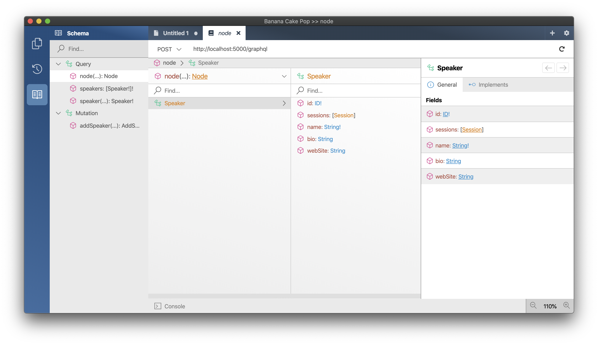

- [GraphQL schema design approaches](#graphql-schema-design-approaches)
  - [Reorganize mutation types](#reorganize-mutation-types)
  - [Enable Relay support](#enable-relay-support)
  - [Build out the schema](#build-out-the-schema)
    - [Think beyond CRUD](#think-beyond-crud)
    - [Offer plural versions fields and be precise about field names](#offer-plural-versions-fields-and-be-precise-about-field-names)
  - [Summary](#summary)

# GraphQL schema design approaches

In GraphQL, most APIs are designed in Relay style. Relay is Facebook's GraphQL client for React and represents Facebook's opinionated view on GraphQL. The GraphQL community adopted the Relay server specifications since it provides a battle-tested way of exposing GraphQL at massive scale.

Relay makes three core assumptions about a GraphQL server:

- The server provides a mechanism for refetching an object.
- The server specifies a way of how to page through connections.
- Mutations are structured in a specific way to make them predictable to use.

## Reorganize mutation types

First, we will restructure our GraphQL server so that it will better scale once we add more types. With Hot Chocolate, we can split types into multiple classes, which is especially useful with root types. Splitting our root types allows us to organize our queries, mutations, and subscriptions by topic rather then having all of them in one massive class. Moreover, in tests, we can load only the parts of a query-, mutation-, or subscription-type that we need.

1. Create a new folder `Common`.

   ```console
   mkdir ConferencePlanner.GraphQL/Common
   ```

1. Create a class `Payload.cs` in the `Common` directory with the following code:

   ```csharp
   namespace ConferencePlanner.GraphQL.Common;

   public abstract class Payload
   {
       protected Payload(IReadOnlyList<UserError>? errors = null)
       {
           Errors = errors;
       }

       public IReadOnlyList<UserError>? Errors { get; }
   }
   ```

1. Next, we create a new class `UserError` that is also located in the `Common` directory with the following code:

   ```csharp
   namespace ConferencePlanner.GraphQL.Common;

   public class UserError
   {
       public UserError(string message, string code)
       {
           Message = message;
           Code = code;
       }

       public string Message { get; }

       public string Code { get; }
   }
   ```

Now, that we have some base classes for our mutation let us start to reorganize the mutation type.

1. Create a new folder `Speakers`.

   ```console
   mkdir ConferencePlanner.GraphQL/Speakers
   ```

1. Move the `Mutation.cs` to the `Speakers` folder and rename it to `SpeakerMutations`.

1. Now, annotate the renamed class with the `ExtendObjectTypeAttribute.` The class should look like this now:

   ```csharp
   using ConferencePlanner.GraphQL.Data;

   namespace ConferencePlanner.GraphQL.Speakers;

   [ExtendObjectType("Mutation")]
   public class SpeakerMutations
   {
       [UseDbContext(typeof(ApplicationDbContext))]
       public async Task<AddSpeakerPayload> AddSpeakerAsync(
           AddSpeakerInput input,
           [ScopedService] ApplicationDbContext context)
       {
           var speaker = new Speaker
           {
               Name = input.Name,
               Bio = input.Bio,
               WebSite = input.WebSite
           };

           context.Speakers.Add(speaker);
           await context.SaveChangesAsync();

           return new AddSpeakerPayload(speaker);
       }
   }
   ```

1. Move the `AddSpeakerInput.cs` into the `Speakers` directory.

   ```csharp
   namespace ConferencePlanner.GraphQL.Speakers;

   public record AddSpeakerInput(
       string Name,
       string? Bio,
       string? WebSite);
   ```

1. Next, create a new class `SpeakerPayloadBase.cs` with the following code:

   ```csharp
   using ConferencePlanner.GraphQL.Common;
   using ConferencePlanner.GraphQL.Data;

   namespace ConferencePlanner.GraphQL.Speakers;

   public class SpeakerPayloadBase : Payload
   {
       protected SpeakerPayloadBase(Speaker speaker)
       {
           Speaker = speaker;
       }

       protected SpeakerPayloadBase(IReadOnlyList<UserError> errors)
           : base(errors)
       {
       }

       public Speaker? Speaker { get; }
   }
   ```

1. Now, move the `AddSpeakerPayload.cs` and base it on the new `SpeakerPayloadBase`. The code should now look like the following:

   ```csharp
   using ConferencePlanner.GraphQL.Common;
   using ConferencePlanner.GraphQL.Data;

   namespace ConferencePlanner.GraphQL.Speakers;

   public class AddSpeakerPayload : SpeakerPayloadBase
   {
       public AddSpeakerPayload(Speaker speaker)
           : base(speaker)
       {
       }

       public AddSpeakerPayload(IReadOnlyList<UserError> errors)
           : base(errors)
       {
       }
   }
   ```

1. Change the schema configurations so that we can merge the various `Mutation` class that we will have into one. For that replace the schema builder configuration with the following code in the `Program.cs`:

   ```csharp
   builder.Services
       .AddGraphQLServer()
       .AddQueryType<Query>()
       .AddMutationType(d => d.Name("Mutation"))
           .AddTypeExtension<SpeakerMutations>()
       .AddType<SpeakerType>()
       .AddDataLoader<SpeakerByIdDataLoader>()
       .AddDataLoader<SessionByIdDataLoader>();
   ```

## Enable Relay support

Now that we have reorganized our mutations, we will refactor the schema to a proper relay style. The first thing we have to do here is to `AddGlobalObjectIdentification` on the schema. After that, we will focus on the first Relay server specification called **Global Object Identification**.

1. Enable relay support for the schema.

   ```csharp
   services
       .AddGraphQLServer()
       .AddQueryType<Query>()
       .AddMutationType(d => d.Name("Mutation"))
           .AddTypeExtension<SpeakerMutations>()
       .AddType<SpeakerType>()
       .AddGlobalObjectIdentification()
       .AddDataLoader<SpeakerByIdDataLoader>()
       .AddDataLoader<SessionByIdDataLoader>();
   ```

1. Configure the speaker entity to implement the `Node` interface by adding the node configuration to the `SpeakerType.cs`.

   ```csharp
   using Microsoft.EntityFrameworkCore;
   using ConferencePlanner.GraphQL.Data;
   using ConferencePlanner.GraphQL.DataLoader;

   namespace ConferencePlanner.GraphQL.Types;

   public class SpeakerType : ObjectType<Speaker>
   {
       protected override void Configure(IObjectTypeDescriptor<Speaker> descriptor)
       {
           descriptor
               .ImplementsNode()
               .IdField(t => t.Id)
               .ResolveNode((ctx, id) => ctx.DataLoader<SpeakerByIdDataLoader>().LoadAsync(id, ctx.RequestAborted));

           descriptor
               .Field(t => t.SessionSpeakers)
               .ResolveWith<SpeakerResolvers>(t => t.GetSessionsAsync(default!, default!, default!, default))
               .UseDbContext<ApplicationDbContext>()
               .Name("sessions");
       }

       private class SpeakerResolvers
       {
           public async Task<IEnumerable<Session>> GetSessionsAsync(
               Speaker speaker,
               [ScopedService] ApplicationDbContext dbContext,
               SessionByIdDataLoader sessionById,
               CancellationToken cancellationToken)
           {
               int[] speakerIds = await dbContext.Speakers
                   .Where(s => s.Id == speaker.Id)
                   .Include(s => s.SessionSpeakers)
                   .SelectMany(s => s.SessionSpeakers.Select(t => t.SessionId))
                   .ToArrayAsync();

               return await sessionById.LoadAsync(speakerIds, cancellationToken);
           }
       }
   }
   ```

   > The following piece of code marked our `SpeakerType.cs` as implementing the `Node` interface. It also defined that the `id` field that the node interface specifies is implemented by the `Id` on our entity. The internal `Id` is consequently rewritten to a global object identifier that contains the internal id plus the type name. Last but not least we defined a `ResolveNode` that is able to load the entity by `id`.
   >
   > ```csharp
   > descriptor
   >    .ImplementsNode()
   >    .IdField(t => t.Id)
   >    .ResolveNode((ctx, id) => ctx.DataLoader<SpeakerByIdDataLoader>()
   >    .LoadAsync(id, ctx.RequestAborted));
   > ```

1. Head over to the `Query.cs` and annotate the `id` argument of `GetSpeaker` with the `ID` attribute.

   ```csharp
   public Task<Speaker> GetSpeakerAsync(
       [ID(nameof(Speaker))] int id,
       SpeakerByIdDataLoader dataLoader,
       CancellationToken cancellationToken) =>
       dataLoader.LoadAsync(id, cancellationToken);
   ```

   > Wherever we handle `id` values we need to annotate them with the `ID` attribute in order to tell the execution engine what kind of `ID` this is. We also can do that in the fluent API by using the `ID` descriptor method a field or argument descriptor.
   >
   > ```csharp
   > descriptor.Field(t => t.FooId).ID("FOO");
   > ```

1. Start the GraphQL server.

   ```console
   dotnet run --project ConferencePlanner.GraphQL
   ```

1. Head to Banana Cake Pop and refresh the schema.

   

## Build out the schema

This step will add more DataLoader and schema types, while this will be a bit mechanical, it will form the basis for our ventures into proper GraphQL schema design.

We will start by adding the rest of the DataLoader that we will need. Then we will add types for `Attendee`, `Track`, and `Session`. Last, we will reorganize our query type so that we can split it as well. Once we have all this in, we will start diving into some schema design rules and how to apply them.

1. Add missing DataLoader to the `DataLoader` directory.

   `AttendeeByIdDataLoader.cs`

   ```csharp
   using Microsoft.EntityFrameworkCore;
   using ConferencePlanner.GraphQL.Data;

   namespace ConferencePlanner.GraphQL.DataLoader;

   public class AttendeeByIdDataLoader : BatchDataLoader<int, Attendee>
   {
       private readonly IDbContextFactory<ApplicationDbContext> _dbContextFactory;

       public AttendeeByIdDataLoader(
           IBatchScheduler batchScheduler,
           IDbContextFactory<ApplicationDbContext> dbContextFactory)
           : base(batchScheduler)
       {
           _dbContextFactory = dbContextFactory ??
               throw new ArgumentNullException(nameof(dbContextFactory));
       }

       protected override async Task<IReadOnlyDictionary<int, Attendee>> LoadBatchAsync(
           IReadOnlyList<int> keys,
           CancellationToken cancellationToken)
       {
           await using ApplicationDbContext dbContext =
               _dbContextFactory.CreateDbContext();

           return await dbContext.Attendees
               .Where(s => keys.Contains(s.Id))
               .ToDictionaryAsync(t => t.Id, cancellationToken);
       }
   }
   ```

   `TrackByIdDataLoader.cs`

   ```csharp
   using Microsoft.EntityFrameworkCore;
   using ConferencePlanner.GraphQL.Data;

   namespace ConferencePlanner.GraphQL.DataLoader;

   public class TrackByIdDataLoader : BatchDataLoader<int, Track>
   {
       private readonly IDbContextFactory<ApplicationDbContext> _dbContextFactory;

       public TrackByIdDataLoader(
           IBatchScheduler batchScheduler,
           IDbContextFactory<ApplicationDbContext> dbContextFactory)
           : base(batchScheduler)
       {
           _dbContextFactory = dbContextFactory ??
               throw new ArgumentNullException(nameof(dbContextFactory));
       }

       protected override async Task<IReadOnlyDictionary<int, Track>> LoadBatchAsync(
           IReadOnlyList<int> keys,
           CancellationToken cancellationToken)
       {
           await using ApplicationDbContext dbContext =
               _dbContextFactory.CreateDbContext();

           return await dbContext.Tracks
               .Where(s => keys.Contains(s.Id))
               .ToDictionaryAsync(t => t.Id, cancellationToken);
       }
   }
   ```

1. Now, copy the missing type classes, `AttendeeType.cs`, `TrackType.cs`, and `SessionType.cs` from `./code/Types` to the `Types` directory.

1. Move the `Query.cs` to the `Speakers` directory and rename it to `SpeakerQueries.cs`.

1. Next, add the `[ExtendObjectType("Query")]` on top of our `SpeakerQueries` class. The code should now look like the following.

   ```csharp
   using Microsoft.EntityFrameworkCore;
   using ConferencePlanner.GraphQL.Data;
   using ConferencePlanner.GraphQL.DataLoader;

   namespace ConferencePlanner.GraphQL.Speakers;

   [ExtendObjectType("Query")]
   public class SpeakerQueries
   {
       [UseDbContext(typeof(ApplicationDbContext))]
       public Task<List<Speaker>> GetSpeakers([ScopedService] ApplicationDbContext context) =>
           context.Speakers.ToListAsync();

       public Task<Speaker> GetSpeakerAsync(
           [ID(nameof(Speaker))]int id,
           SpeakerByIdDataLoader dataLoader,
           CancellationToken cancellationToken) =>
           dataLoader.LoadAsync(id, cancellationToken);
   }
   ```

1. Head over to the `Program.cs` and lets reconfigure the schema builder like we did with the `Mutation` type. The new schema configuration should look like the following:

   ```csharp
   builder.Services
       .AddGraphQLServer()
       .AddQueryType(d => d.Name("Query"))
           .AddTypeExtension<SpeakerQueries>()
       .AddMutationType(d => d.Name("Mutation"))
           .AddTypeExtension<SpeakerMutations>()
       .AddType<SpeakerType>()
       .AddGlobalObjectIdentification();
   ```

1. Register the `AttendeeType`, `TrackType`, and `SessionType` with the schema builder.

   ```csharp
   builder.Services
       .AddGraphQLServer()
       .AddQueryType(d => d.Name("Query"))
           .AddTypeExtension<SpeakerQueries>()
       .AddMutationType(d => d.Name("Mutation"))
           .AddTypeExtension<SpeakerMutations>()
       .AddType<AttendeeType>()
       .AddType<SessionType>()
       .AddType<SpeakerType>()
       .AddType<TrackType>()
       .AddGlobalObjectIdentification();
   ```

Great, we now have our base schema and are ready to dive into some schema design topics. Although GraphQL has a single root query type, a single root mutation type, and a single root subscription type, Hot Chocolate allows splitting the root types into multiple classes, which will enable us to organize our schema around topics rather than divide it along its root types.

### Think beyond CRUD

GraphQL represents a much better way to expose APIs over HTTP. GraphQL wants us to think beyond standard CRUD APIs. By using action or behavior specific fields and mutations, we can create a more human-readable API that helps clients use our API.

In this chapter, we will design our mutation API by really thinking about the use-cases of our conference API. We do not just want to expose our database model to the user; we want to create an understandable and easy-to-use API driven by use-cases rather than the raw data structures.

First, we will focus on the sessions. The session is the primary data model we are interacting with. People want to lookup sessions, schedule sessions, search for sessions, or even file new sessions.

Conferences typically first ask for papers; after some time, they will accept some of the proposed talks. After more time, they will build from these sessions the schedule. Often the program is divided into tracks. A talk will also often be moved around until the conference starts, but even at this point, schedule changes might happen.

This reflection on our subject at hand leads us to two mutations that we need. First, we need to be able to add new sessions; then, we need to be able to schedule sessions on a specific track and time slot.

1. Create a new directory called `Sessions`

```console
mkdir ConferencePlanner.GraphQL/Sessions
```

1. Copy the class `SessionPayloadBase.cs` from `./code/Sessions` in the `Sessions` directory.

   > The `SessionPayloadBase` will be the base for all of our session payloads.

1. Copy the following classes from `./code/Sessions` in the `Sessions` directory.

- `AddSessionInput.cs`
- `AddSessionPayload.cs`
- `SessionMutations.cs`

  > Our `addSession` mutation will only let you specify the title, the abstract and the speakers.

1. Head back to the `Program.cs` and add the `SessionMutations` to the schema builder.

   ```csharp
   builder.Services
       .AddGraphQLServer()
       .AddQueryType(d => d.Name("Query"))
           .AddTypeExtension<SpeakerQueries>()
       .AddMutationType(d => d.Name("Mutation"))
           .AddTypeExtension<SessionMutations>()
           .AddTypeExtension<SpeakerMutations>()
       .AddType<AttendeeType>()
       .AddType<SessionType>()
       .AddType<SpeakerType>()
       .AddType<TrackType>()
       .AddGlobalObjectIdentification();
   ```

1. Next, copy `ScheduleSessionInput.cs`, `ScheduleSessionPayload.cs` from `./code/Sessions` to our `Sessions` directory.

1. Now, insert the following `scheduleSession` mutation to the `SessionMutations` class:

   ```csharp
   [UseDbContext(typeof(ApplicationDbContext))]
   public async Task<ScheduleSessionPayload> ScheduleSessionAsync(
       ScheduleSessionInput input,
       [ScopedService] ApplicationDbContext context)
   {
       if (input.EndTime < input.StartTime)
       {
           return new ScheduleSessionPayload(
               new UserError("endTime has to be larger than startTime.", "END_TIME_INVALID"));
       }

       Session? session = await context.Sessions.FindAsync(input.SessionId);

       if (session is null)
       {
           return new ScheduleSessionPayload(
               new UserError("Session not found.", "SESSION_NOT_FOUND"));
       }

       session.TrackId = input.TrackId;
       session.StartTime = input.StartTime;
       session.EndTime = input.EndTime;

       await context.SaveChangesAsync();

       return new ScheduleSessionPayload(session);
   }
   ```

   While we now are able to add sessions and then schedule them, we still need some mutations to create a track or rename a track.

1. Create a new directory called `Tracks`

   ```console
   mkdir ConferencePlanner.GraphQL/Tracks
   ```

1. Copy the classes `TrackPayloadBase.cs`, `AddTrackInput.cs` & `AddTrackPayload.cs` from `./code/Tracks` to the `Tracks` directory.

1. Now that you have the payload and input files in create a new class `TracksMutations.cs` with the following code:

   ```csharp
   using ConferencePlanner.GraphQL.Data;

   namespace ConferencePlanner.GraphQL.Tracks;

   [ExtendObjectType("Mutation")]
   public class TrackMutations
   {
       [UseDbContext(typeof(ApplicationDbContext))]
       public async Task<AddTrackPayload> AddTrackAsync(
           AddTrackInput input,
           [ScopedService] ApplicationDbContext context,
           CancellationToken cancellationToken)
       {
           var track = new Track { Name = input.Name };
           context.Tracks.Add(track);

           await context.SaveChangesAsync(cancellationToken);

           return new AddTrackPayload(track);
       }
   }
   ```

1. Head back to the `Programm.cs` and add the `TrackMutations` to the schema builder.

   ```csharp
   builder.Services
       .AddGraphQLServer()
       .AddQueryType(d => d.Name("Query"))
           .AddTypeExtension<SpeakerQueries>()
       .AddMutationType(d => d.Name("Mutation"))
           .AddTypeExtension<SessionMutations>()
           .AddTypeExtension<SpeakerMutations>()
           .AddTypeExtension<TrackMutations>()
       .AddType<AttendeeType>()
       .AddType<SessionType>()
       .AddType<SpeakerType>()
       .AddType<TrackType>()
       .AddGlobalObjectIdentification()
       .AddDataLoader<SpeakerByIdDataLoader>()
       .AddDataLoader<SessionByIdDataLoader>();
   ```

1. Next, we need to get our `renameTrack` mutation in. For this copy the classes `RenameTrackInput.cs` and `RenameTrackPayload.cs` from `./code/Tracks` in the `Tracks` directory.

1. Last, we will add the `renameTrack` mutation to our `TrackMutations` class.

   ```csharp
   [UseDbContext(typeof(ApplicationDbContext))]
   public async Task<RenameTrackPayload> RenameTrackAsync(
       RenameTrackInput input,
       [ScopedService] ApplicationDbContext context,
       CancellationToken cancellationToken)
   {
       Track? track = await context.Tracks.FindAsync(input.Id);

       if (track is null)
       {
           return new RenameTrackPayload(
               new UserError("Track not found.", "TRACK_NOT_FOUND"));
       }

       track.Name = input.Name;

       await context.SaveChangesAsync(cancellationToken);

       return new RenameTrackPayload(track);
   }
   ```

1. Start your GraphQL server and verify that your `Mutations` work by adding some sessions, creating tracks and scheduling the sessions to the tracks.

   ```console
   dotnet run --project ConferencePlanner.GraphQL
   ```

> The DateTime format in GraphQL is specified by RFC3399 and looks like the following: `2020-05-24T15:00:00`. More about the GraphQL `DateTime` scalar can be found here: https://www.graphql-scalars.com/date-time/

### Offer plural versions fields and be precise about field names

With GraphQL, we want to think about efficiency a lot. For instance, we offer mutations with one `input` argument so that clients can assign this argument from one variable without needing to deconstruct. Almost every little aspect in GraphQL is done so that you can request data more efficiently. That is why we also should design our schema in such a way that we allow users of our API to fetch multiple entities in one go.

Sure, we technically can do that already.

```graphql
query {
  speaker1: speaker(id: 1) {
    name
  }
  speaker2: speaker(id: 2) {
    name
  }
}
```

But with plural versions, we can specify a variable of ids and pass that into a query without modifying the query text itself. By doing that, we can use static queries on our client and also let the query engine of the GraphQL server optimize this static query for execution. Further, we can write a resolver that is optimized to fetch data in one go. Offering plural fields allows for more flexibility and better performance.

The second aspect here is to be more specific about our fields. The name `speaker` is quite unspecific, and we are already starting to get a problem with this once we introduce a plural version of it called `speakers` since we already have a field `speakers` that is the list of speakers. A good choice in `GraphQL` would be to name the fields `speakerById` and the second one, `speakersById`.

In this section, we will optimize our `Query` type by bringing in more fields to query our API. Also we will restructure our query type to offer plural versions of our fields that fetch by id.

1. Head over to your `SpeakerQueries` class and update the `speaker` field to be named `speakerById`.

   ```csharp
   using Microsoft.EntityFrameworkCore;
   using ConferencePlanner.GraphQL.Data;
   using ConferencePlanner.GraphQL.DataLoader;

   namespace ConferencePlanner.GraphQL.Speakers;

   [ExtendObjectType("Query")]
   public class SpeakerQueries
   {
       [UseDbContext(typeof(ApplicationDbContext))]
       public Task<List<Speaker>> GetSpeakersAsync(
           [ScopedService] ApplicationDbContext context) =>
           context.Speakers.ToListAsync();

       public Task<Speaker> GetSpeakerByIdAsync(
           [ID(nameof(Speaker))]int id,
           SpeakerByIdDataLoader dataLoader,
           CancellationToken cancellationToken) =>
           dataLoader.LoadAsync(id, cancellationToken);
   }
   ```

1. Next, introduce a new `GetSpeakersByIdAsync` method as our plural version.

   > Note that the `DataLoader` can also fetch multiples for us.

   ```csharp
   using Microsoft.EntityFrameworkCore;
   using ConferencePlanner.GraphQL.Data;
   using ConferencePlanner.GraphQL.DataLoader;

   namespace ConferencePlanner.GraphQL.Speakers;

   [ExtendObjectType("Query")]
   public class SpeakerQueries
   {
       [UseDbContext(typeof(ApplicationDbContext))]
       public Task<List<Speaker>> GetSpeakersAsync(
           [ScopedService] ApplicationDbContext context) =>
           context.Speakers.ToListAsync();

       public Task<Speaker> GetSpeakerByIdAsync(
           [ID(nameof(Speaker))] int id,
           SpeakerByIdDataLoader dataLoader,
           CancellationToken cancellationToken) =>
           dataLoader.LoadAsync(id, cancellationToken);

       public async Task<IEnumerable<Speaker>> GetSpeakersByIdAsync(
           [ID(nameof(Speaker))] int[] ids,
           SpeakerByIdDataLoader dataLoader,
           CancellationToken cancellationToken) =>
           await dataLoader.LoadAsync(ids, cancellationToken);
   }
   ```

1. Add a new class `SessionQueries.cs` to the `Sessions` directory with the following code:

   ```csharp
   using Microsoft.EntityFrameworkCore;
   using ConferencePlanner.GraphQL.Data;
   using ConferencePlanner.GraphQL.DataLoader;

   namespace ConferencePlanner.GraphQL.Sessions;

   [ExtendObjectType("Query")]
   public class SessionQueries
   {
       [UseDbContext(typeof(ApplicationDbContext))]
       public async Task<IEnumerable<Session>> GetSessionsAsync(
           [ScopedService] ApplicationDbContext context,
           CancellationToken cancellationToken) =>
           await context.Sessions.ToListAsync(cancellationToken);

       public Task<Session> GetSessionByIdAsync(
           [ID(nameof(Session))] int id,
           SessionByIdDataLoader sessionById,
           CancellationToken cancellationToken) =>
           sessionById.LoadAsync(id, cancellationToken);

       public async Task<IEnumerable<Session>> GetSessionsByIdAsync(
           [ID(nameof(Session))] int[] ids,
           SessionByIdDataLoader sessionById,
           CancellationToken cancellationToken) =>
           await sessionById.LoadAsync(ids, cancellationToken);
   }
   ```

1. Register the `SessionQueries` with the schema builder which is located in the `Program.cs`

   ```csharp
   builder.Services
       .AddGraphQLServer()
       .AddQueryType(d => d.Name("Query"))
           .AddTypeExtension<SessionQueries>()
           .AddTypeExtension<SpeakerQueries>()
       .AddMutationType(d => d.Name("Mutation"))
           .AddTypeExtension<SessionMutations>()
           .AddTypeExtension<SpeakerMutations>()
           .AddTypeExtension<TrackMutations>()
       .AddType<AttendeeType>()
       .AddType<SessionType>()
       .AddType<SpeakerType>()
       .AddType<TrackType>()
       .AddGlobalObjectIdentification();
   ```

1. Next add a class `TrackQueries.cs` to the `Tracks` directory with the following code:

   ```csharp
   using Microsoft.EntityFrameworkCore;
   using ConferencePlanner.GraphQL.Data;
   using ConferencePlanner.GraphQL.DataLoader;

   namespace ConferencePlanner.GraphQL.Tracks;

   [ExtendObjectType("Query")]
   public class TrackQueries
   {
       [UseDbContext(typeof(ApplicationDbContext))]
       public async Task<IEnumerable<Track>> GetTracksAsync(
           [ScopedService] ApplicationDbContext context,
           CancellationToken cancellationToken) =>
           await context.Tracks.ToListAsync(cancellationToken);

       [UseDbContext(typeof(ApplicationDbContext))]
       public Task<Track> GetTrackByNameAsync(
           string name,
           [ScopedService] ApplicationDbContext context,
           CancellationToken cancellationToken) =>
           context.Tracks.FirstAsync(t => t.Name == name);

       [UseDbContext(typeof(ApplicationDbContext))]
       public async Task<IEnumerable<Track>> GetTrackByNamesAsync(
           string[] names,
           [ScopedService] ApplicationDbContext context,
           CancellationToken cancellationToken) =>
           await context.Tracks.Where(t => names.Contains(t.Name)).ToListAsync();

       public Task<Track> GetTrackByIdAsync(
           [ID(nameof(Track))] int id,
           TrackByIdDataLoader trackById,
           CancellationToken cancellationToken) =>
           trackById.LoadAsync(id, cancellationToken);

       public async Task<IEnumerable<Track>> GetTracksByIdAsync(
           [ID(nameof(Track))] int[] ids,
           TrackByIdDataLoader trackById,
           CancellationToken cancellationToken) =>
           await trackById.LoadAsync(ids, cancellationToken);
   }
   ```

1. Again, head over to the `Program.cs` and register the `TrackQueries` with the schema builder.

   ```csharp
   builder.Services
       .AddGraphQLServer()
       .AddQueryType(d => d.Name("Query"))
           .AddTypeExtension<SessionQueries>()
           .AddTypeExtension<SpeakerQueries>()
           .AddTypeExtension<TrackQueries>()
       .AddMutationType(d => d.Name("Mutation"))
           .AddTypeExtension<SessionMutations>()
           .AddTypeExtension<SpeakerMutations>()
           .AddTypeExtension<TrackMutations>()
       .AddType<AttendeeType>()
       .AddType<SessionType>()
       .AddType<SpeakerType>()
       .AddType<TrackType>()
       .AddGlobalObjectIdentification();
   ```

1. Start you GraphQL server and verify with Banana Cake Pop that you can use the new queries.

   ```console
   dotnet run --project ConferencePlanner.GraphQL
   ```

1. With this query you see that the id of the speaker is now a NodeId. If you decode this base64 you will see the following information:

   - Entity (Speaker)
   - ID (1)
   - Datentype (integer)

   ```graphql
   query {
     speakers {
       id
       name
     }
   }
   ```

1. With the NodeId you can now query the entity via the node query. Depending on the entity you have to select the desired return type.

   ```graphql
   query {
     node(id: "U3BlYWtlcgppMQ==") {
       ... on Speaker {
         id
         name
       }
     }
   }
   ```

## Summary

We have covered quite a lot in this section. We have learned that GraphQL is designed for efficiency and that many of the schema design principals are designed around this core principle of GraphQL. We looked at how Mutations should be structured and that we should aim to design GraphQL schemas, not around a database schema but instead around our business model. With GraphQL we have such strong capabilities to express our business model that we should look beyond simple crud. Expressively design your schema so that each mutation conveys very clearly what it does. Allow your consumers to fetch single entities or multiple entities without forcing them to aliases.

[**<< Session #2 - Understanding GraphQL query execution and DataLoader**](../02-understanding-dataLoader/README.md) | [**Session #4 - Understanding middleware and add complex filter capabilities >>**](../04-middleware-and-complex-filter-capabilities/README.md)
