- [Understanding middleware](#understanding-middleware)
  - [Add UseUpper middleware](#add-useupper-middleware)
  - [Create middleware attribute](#create-middleware-attribute)
  - [Middleware order](#middleware-order)
- [Adding complex filter capabilities](#adding-complex-filter-capabilities)
  - [Add paging to your lists](#add-paging-to-your-lists)
  - [Add filter capabilities to the top-level field `sessions`](#add-filter-capabilities-to-the-top-level-field-sessions)
  - [Summary](#summary)

# Understanding middleware

The field middleware is one of the foundational components in Hot Chocolate. Many features that you use like, for instance, the `ID` transformation from internal IDs to global object identifiers, are a field middleware. Even resolvers are compiled into a field middleware.

All the middleware that are applied to a field are compiled into one delegate that can be executed. Each middleware knows about the next middleware component in its chain and with this can choose to execute logic before it or after it or before and after it. Also, a middleware might skip the next middleware in line by not calling next.

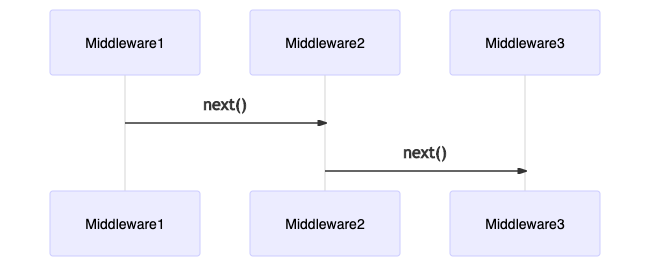

A field middleware can be defined by binding it to a field with the descriptor API:

```csharp
context.Use(next => async context =>
{
    // do some logic

    // invoke next middleware component in the chain.
    await next(context);

    // do some more logic
})
```

A resolver pipeline is built by applying middleware in order, meaning that the first declared middleware on the field descriptor is the first one executed in the pipeline. The last middleware in the field resolver pipeline is always the field resolver itself.

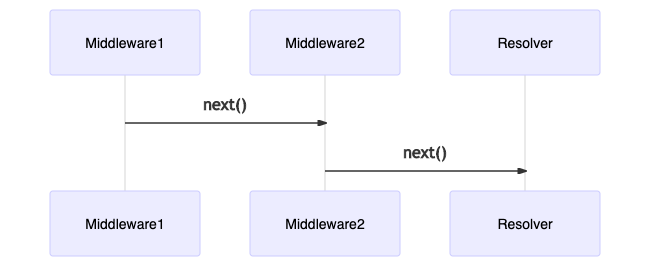

The field resolver middleware will only execute if no result has been produced so far. So, if any middleware has set the `Result` property on the context, the field resolver will be skipped.

Let us write a little middleware that makes a string into an all upper case string to understand better how field middleware works.

```csharp
descriptor.Use(next => async context =>
{
    await next(context);

    if (context.Result is string s)
    {
        context.Result = s.ToUpperInvariant();
    }
});
```

The above middleware first invokes the `next` middleware, and by doing so, gives up control and lets the rest of the pipeline do its job.

After `next` has finished executing, the middleware checks if the result is a `string`, and if so, it applies a `ToUpperInvariant` on that `string` and writes back the updated `string` to `context.Result`.

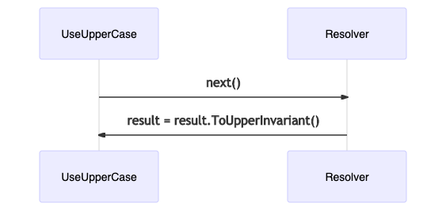

## Add UseUpper middleware

1. Create a `Extensions` folder in your `ConferencePlanner.GraphQL` project.

   1. `mkdir ConferencePlanner.GraphQL/Extensions`

1. Create class `ObjectFieldDescriptorExtensions.cs` in `Extensions` and add the `UseUpperCase` extension method

   ```csharp
   namespace ConferencePlanner.GraphQL;

   public static class ObjectFieldDescriptorExtensions
   {
       public static IObjectFieldDescriptor UseUpperCase(
             this IObjectFieldDescriptor descriptor)
       {
           return descriptor.Use(next => async context =>
           {
               await next(context);

               if (context.Result is string s)
               {
                   context.Result = s.ToUpperInvariant();
               }
           });
       }
   }
   ```

1. Head over to the `TrackType` in the `Types` folder and use the middleware on the `name` field.

   ```csharp
   descriptor
       .Field(t => t.Name)
       .UseUpperCase();
   ```

1. Start your server and query your tracks.

   ```console
   dotnet run --project ConferencePlanner.GraphQL
   ```

   ```graphql
   query {
     tracks {
       name
     }
   }
   ```

   The result should correctly present us with the name all in upper-case.

   ```json
   {
     "data": {
       "tracks": [
         {
           "name": "TRACK 1"
         },
         {
           "name": "TRACK 2"
         }
       ]
     }
   }
   ```

## Create middleware attribute

To use middleware on plain C# types, we can wrap them in so-called descriptor attributes. Descriptor attributes let us intercept the descriptors when the type is inferred. For each descriptor type, there is a specific descriptor attribute base class. For our case, we need to use the `ObjectFieldDescriptorAttribute` base class.

1. Create a new class `UseUpperCaseAttribute.cs` in the `Extensions` directory and add the following code:

   ```csharp
   using System.Reflection;
   using HotChocolate.Types.Descriptors;

   namespace ConferencePlanner.GraphQL;

   public class UseUpperCaseAttribute : ObjectFieldDescriptorAttribute
   {
       public override void OnConfigure(
           IDescriptorContext context,
           IObjectFieldDescriptor descriptor,
           MemberInfo member)
       {
           descriptor.UseUpperCase();
       }
   }
   ```

   > This new attribute can now be applied to any property or method on a plain C# type.

   > ```csharp
   > public class Foo
   > {
   >     [UseUpperCase]
   >     public string Bar { get; set; }
   > }
   > ```

## Middleware order

The following diagram shows the complete field request pipeline with filtering and pagination. You can see how, existing middleware are ordered. You have full control over how to order middleware or inject new custom middleware as necessary for your scenarios.

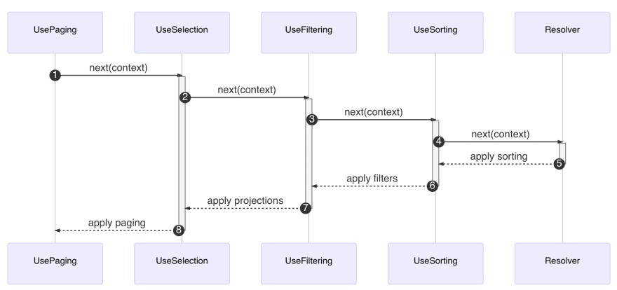

The thing here is that if you take for instance UseFiltering and UsePaging, it would make no sense to first apply paging and basically trim the result in order to then apply filters onto that trimmed result set, the other way around however makes perfect sense.

**Middleware order is important!**

That also means that the order of middleware attributes is important since they form the request pipeline.

# Adding complex filter capabilities

So far, our GraphQL server only exposes plain lists that would, at some point, grow so large that our server would time out. Moreover, we miss some filter capabilities for our session list so that the application using our backend can filter for tracks, titles, or search the abstract for topics.

## Add paging to your lists

Let us start by implementing the last Relay server specification we are still missing in our server by adding Relay compliant paging to our lists. In general, you should avoid plain lists wherever lists grow or are very large. Relay describes a cursor based paging where you can navigate between edges through their cursors. Cursor based paging is ideal whenever you implement infinite scrolling solutions. In contrast to offset-pagination, you cannot jump to a specific page, but you can jump to a particular cursor and navigate from there.

> Many database drivers or databases do not support `skip while`, so Hot Chocolate will under the hood use positions instead of proper IDs for cursors in theses cases. Meaning, you can always use cursor-based pagination, and Hot Chocolate will handle the rest underneath.

1. Head over to the `Tracks`directory and replace the `GetTracksAsync` resolver in the `TrackQueries.cs` with the following code.

   ```csharp
   [UseDbContext(typeof(ApplicationDbContext))]
   [UsePaging]
   public IQueryable<Track> GetTracks(
       [ScopedService] ApplicationDbContext context) =>
       context.Tracks.OrderBy(t => t.Name);
   ```

   > The new resolver will instead of executing the database query return an `IQueryable`. The `IQueryable` is like a query builder. By applying the `UsePaging` middleware, we are rewriting the database query to only fetch the items that we need for our data-set.

   The resolver pipeline for our field now looks like the following:

   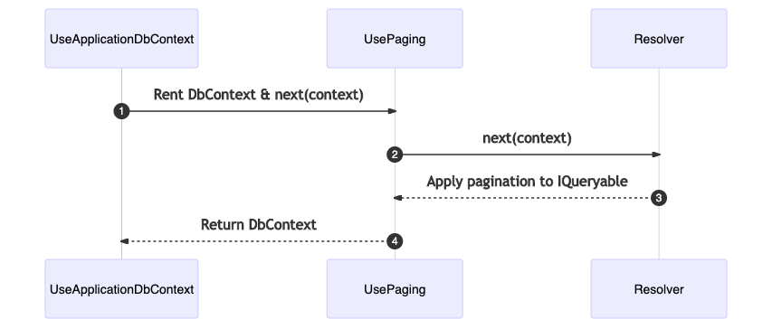

1. Start your GraphQL server.

   ```console
   dotnet run --project ConferencePlanner.GraphQL
   ```

1. Open Banana Cake Pop and refresh the schema.

   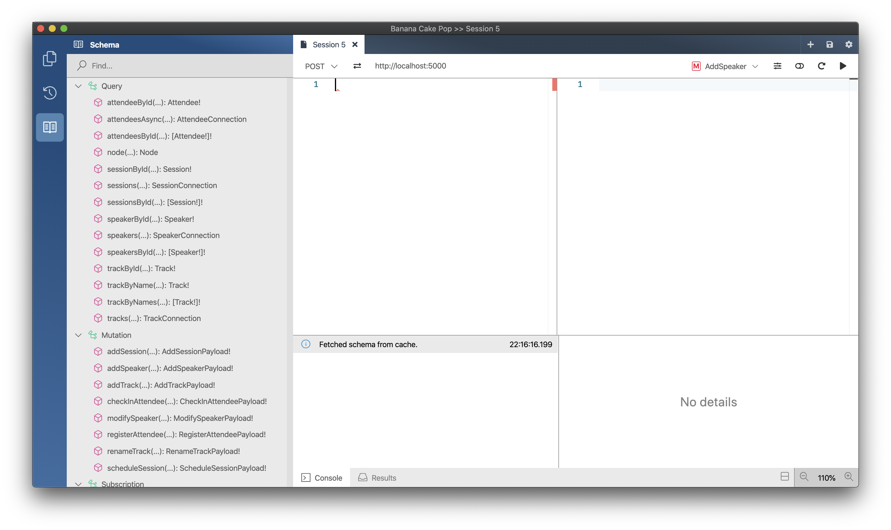

1. Head into the schema browser, and let us have a look at how our API structure has changed.

   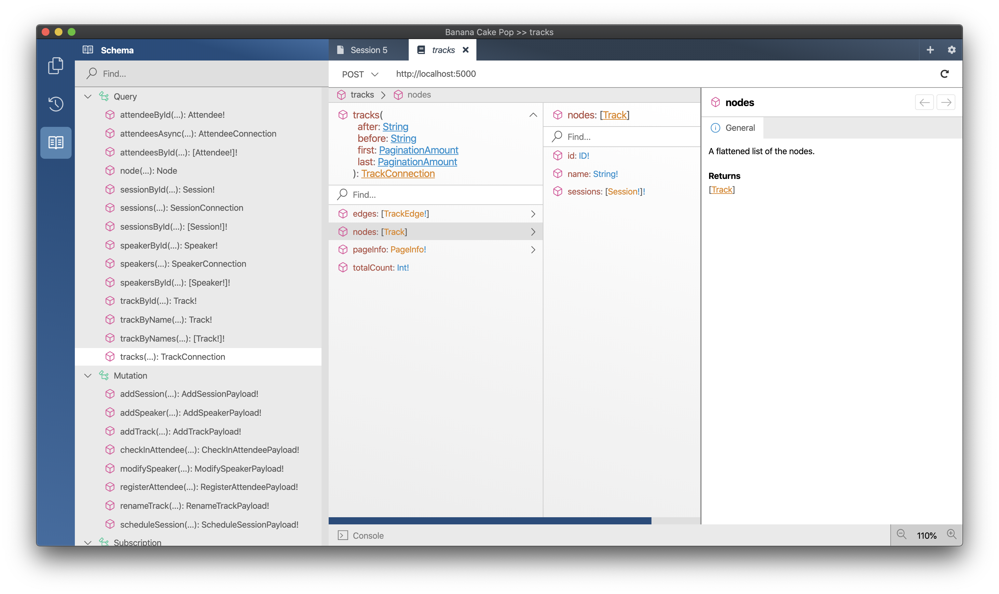

1. Define a simple query to fetch the first track.

   ```graphql
   query GetFirstTrack {
     tracks(first: 1) {
       edges {
         node {
           id
           name
         }
         cursor
       }
       pageInfo {
         startCursor
         endCursor
         hasNextPage
         hasPreviousPage
       }
     }
   }
   ```

   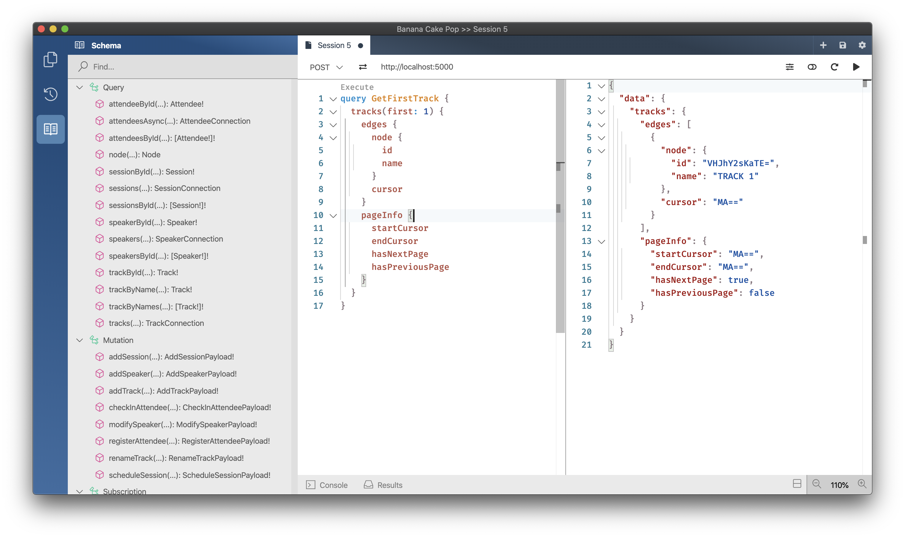

1. Take the cursor from this item and add a second argument after and feed in the cursor.

   ```graphql
   query GetNextItem {
     tracks(first: 1, after: "MA==") {
       edges {
         node {
           id
           name
         }
         cursor
       }
       pageInfo {
         startCursor
         endCursor
         hasNextPage
         hasPreviousPage
       }
     }
   }
   ```

   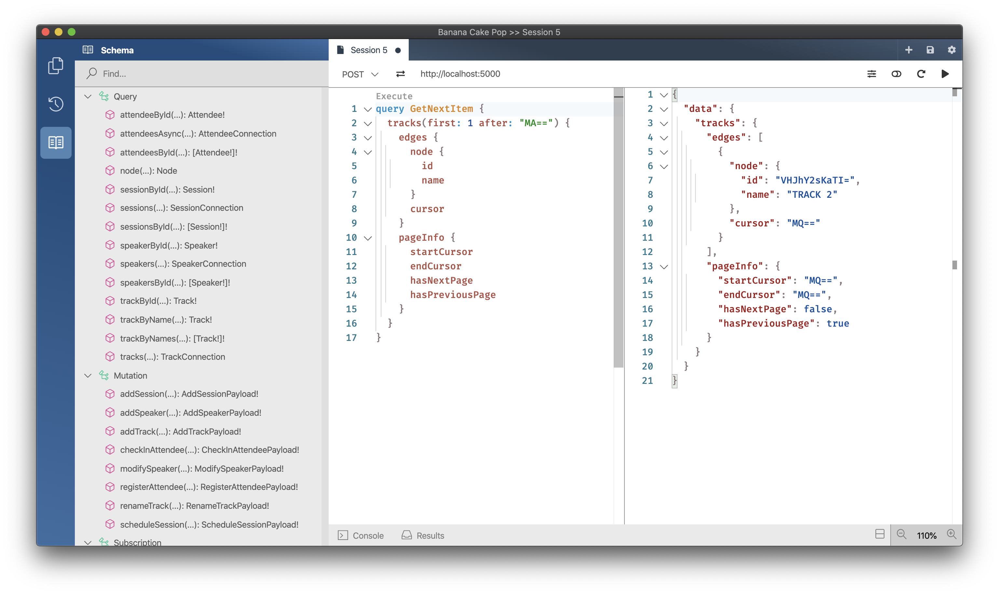

1. Head over to the `SpeakerQueries.cs` which are located in the `Speakers` directory and replace the `GetSpeakersAsync` resolver with the following code:

   ```csharp
   [UseDbContext(typeof(ApplicationDbContext))]
   [UsePaging]
   public IQueryable<Speaker> GetSpeakers(
       [ScopedService] ApplicationDbContext context) =>
       context.Speakers.OrderBy(t => t.Name);
   ```

1. Next, go to the `SessionQueries.cs` in the `Sessions` directory and replace the `GetSessionsAsync` with the following code:

   ```csharp
   [UseDbContext(typeof(ApplicationDbContext))]
   [UsePaging]
   public IQueryable<Session> GetSessions(
       [ScopedService] ApplicationDbContext context) =>
       context.Sessions;
   ```

   We have now replaced all the root level list fields and are now using our pagination middleware. There are still more lists left where we should apply pagination if we wanted to really have a refined schema. Let us change the API a bit more to incorporate this.

1. First, go back to the `SessionQueries.cs` in the `Sessions` directory and replace the `[UsePaging]` with `[UsePaging(typeof(NonNullType<SessionType>))]`.

   ```csharp
   [UseDbContext(typeof(ApplicationDbContext))]
   [UsePaging(typeof(NonNullType<SessionType>))]
   public IQueryable<Session> GetSessions(
       [ScopedService] ApplicationDbContext context) =>
       context.Sessions;
   ```

   > It is important that a connection type works with a fixed item type if we mix attribute and fluent syntax.

1. Next, open the `TrackType.cs` in the `Types` directory and add `.UsePaging<NonNullType<SessionType>>()` to the `Sessions` field descriptor.

   ```csharp
   descriptor
       .Field(t => t.Sessions)
       .ResolveWith<TrackResolvers>(t => t.GetSessionsAsync(default!, default!, default!, default))
       .UseDbContext<ApplicationDbContext>()
       .UsePaging<NonNullType<SessionType>>()
       .Name("sessions");
   ```

1. Now go back to Banana Cake Pop and refresh the schema.

   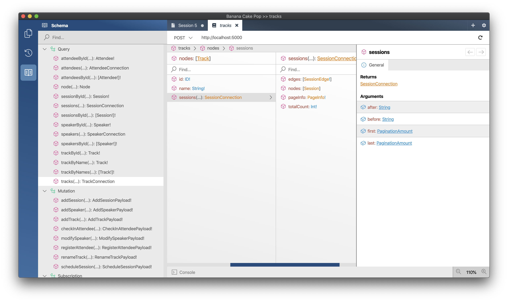

1. Fetch a specific track and get the first session of this track:

   ```graphql
   query GetTrackWithSessions {
     trackById(id: "VHJhY2sKaTI=") {
       id
       sessions(first: 1) {
         nodes {
           title
         }
       }
     }
   }
   ```

   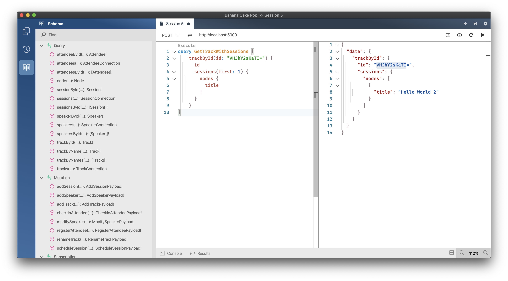

   > There is one caveat in our implementation with the `TrackType`. Since, we are using a DataLoader within our resolver and first fetch the list of IDs we essentially will always fetch everything and chop in memory. In an actual project this can be split into two actions by moving the `DataLoader` part into a middleware and first page on the id queryable. Also one could implement a special `IPagingHandler` that uses the DataLoader and applies paging logic.

## Add filter capabilities to the top-level field `sessions`

Exposing rich filters to a public API can lead to unpredictable performance implications, but using filters wisely on select fields can make your API much better to use. In our conference API it would make almost no sense to expose filters on top of the `tracks` field since the `Track` type really only has one field `name` and filtering on that really seems overkill. The `sessions` field on the other hand could be improved with filter capabilities. The user of our conference app could with filters search for a session in a specific time-window or for sessions of a specific speaker he/she likes.

Filters like paging is a middleware that can be applied on `IQueryable`, like mentioned in the middleware session order is important with middleware. This means our paging middleware has to execute last.


1. Add a reference to the NuGet package package `HotChocolate.Data` version `12.3.2`.

   1. `dotnet add ConferencePlanner.GraphQL package HotChocolate.Data --version 12.3.2`

1. Add filter and sorting conventions to the schema configuration in your `Program.cs`.

   ```csharp
   services
      .AddGraphQLServer()
      .AddQueryType(d => d.Name("Query"))
         .AddTypeExtension<SpeakerQueries>()
         .AddTypeExtension<SessionQueries>()
         .AddTypeExtension<TrackQueries>()
      .AddMutationType(d => d.Name("Mutation"))
         .AddTypeExtension<SessionMutations>()
         .AddTypeExtension<SpeakerMutations>()
         .AddTypeExtension<TrackMutations>()
      .AddType<AttendeeType>()
      .AddType<SessionType>()
      .AddType<SpeakerType>()
      .AddType<TrackType>()
      .AddGlobalObjectIdentification()
      .AddFiltering()
      .AddSorting()
      .AddDataLoader<SpeakerByIdDataLoader>()
      .AddDataLoader<SessionByIdDataLoader>();
   ```

1. Head over to the `SessionQueries.cs` which is located in the `Sessions` directory.

1. Replace the `GetSessions` resolver with the following code:

   ```csharp
   [UseDbContext(typeof(ApplicationDbContext))]
   [UsePaging(typeof(NonNullType<SessionType>))]
   [UseFiltering]
   [UseSorting]
   public IQueryable<Session> GetSessions(
       [ScopedService] ApplicationDbContext context) =>
       context.Sessions;
   ```

   > By default the filter middleware would infer a filter type that exposes all the fields of the entity. In our case it would be better to remove filtering for ids and internal fields and focus on fields that the user really can use.

1. Create a new `SessionFilterInputType.cs` in the `Sessions` directory with the following code:

   ```csharp
   using ConferencePlanner.GraphQL.Data;
   using HotChocolate.Data.Filters;

   namespace ConferencePlanner.GraphQL.Types;

   public class SessionFilterInputType : FilterInputType<Session>
   {
       protected override void Configure(IFilterInputTypeDescriptor<Session> descriptor)
       {
           descriptor.Ignore(t => t.Id);
           descriptor.Ignore(t => t.TrackId);
       }
   }
   ```

   > We essentially have remove the ID fields and leave the rest in.

1. Go back to the `SessionQueries.cs` which is located in the `Sessions` directory and replace the `[UseFiltering]` attribute on top of the `GetSessions` resolver with the following `[UseFiltering(typeof(SessionFilterInputType))]`.

   ```csharp
   [UseDbContext(typeof(ApplicationDbContext))]
   [UsePaging(typeof(NonNullType<SessionType>))]
   [UseFiltering(typeof(SessionFilterInputType))]
   [UseSorting]
   public IQueryable<Session> GetSessions(
       [ScopedService] ApplicationDbContext context) =>
       context.Sessions;
   ```

1. Start your GraphQL server.

   ```console
   dotnet run --project ConferencePlanner.GraphQL
   ```

1. Open Banana Cake Pop and refresh the schema and head over to the schema browser.

   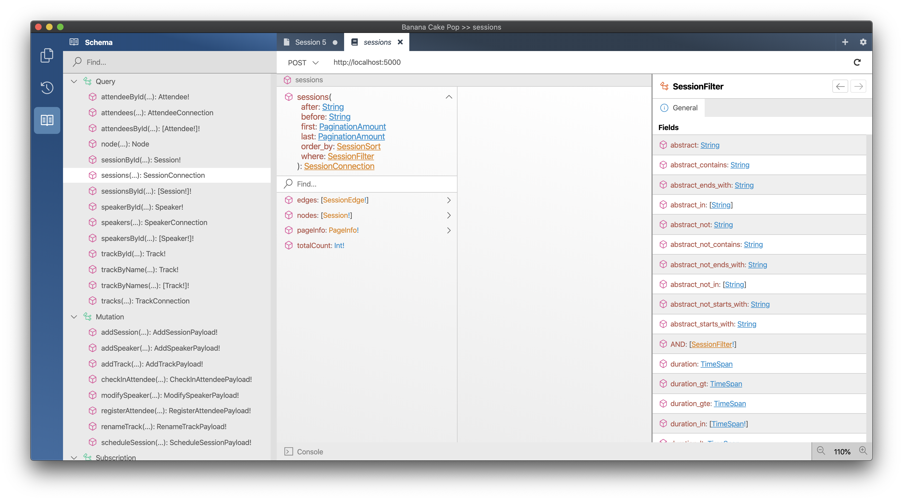

   > We now have an argument `where` on our field that exposes a rich filter type to us.

1. Write the following query to look for all the sessions that contain `2` in their title.

   ```graphql
   query GetSessionsContaining2InTitle {
     sessions(where: { title: { contains: "2" } }) {
       nodes {
         title
       }
     }
   }
   ```

   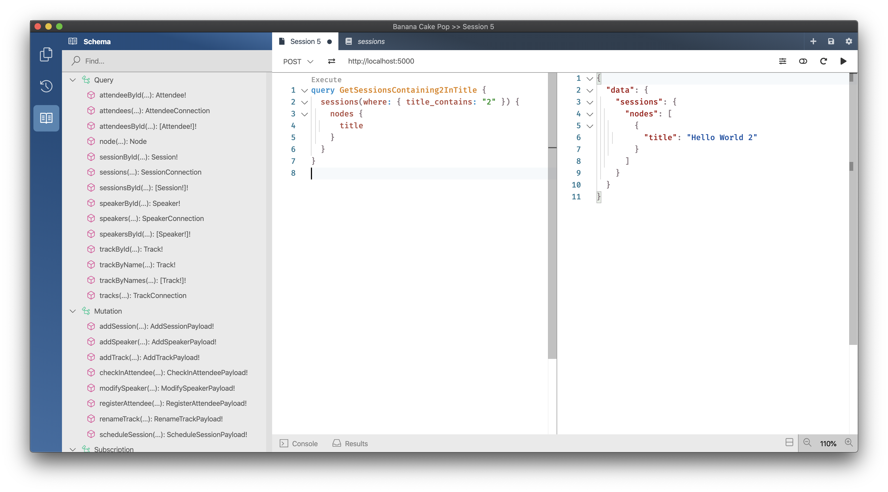

## Summary

In this session, we have looked at what field middleware are and how we can use them to add additional processing logic to our field resolver pipeline.

We have also learned how we can use GraphQL subscription to provide real-time events. GraphQL makes it easy to work with real-time data since we can specify what data we want to receive when an event happens on our system.

[**<< Session #3 - GraphQL schema design**](../03-schema-design-approaches/README.md) | [**Session #5 - Adding real-time functionality with subscriptions >>**](../05-subscriptions/README.md)
