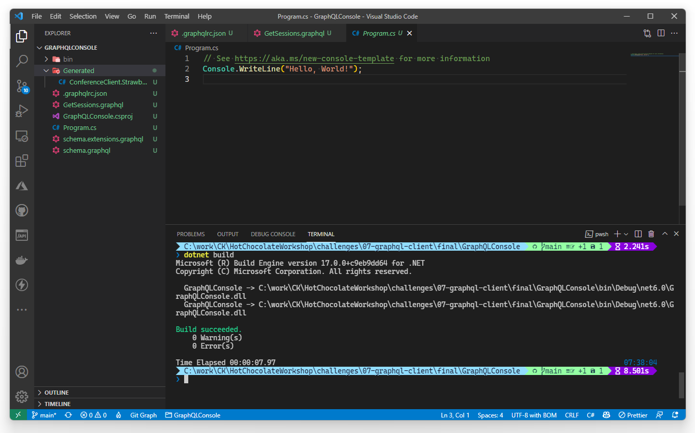
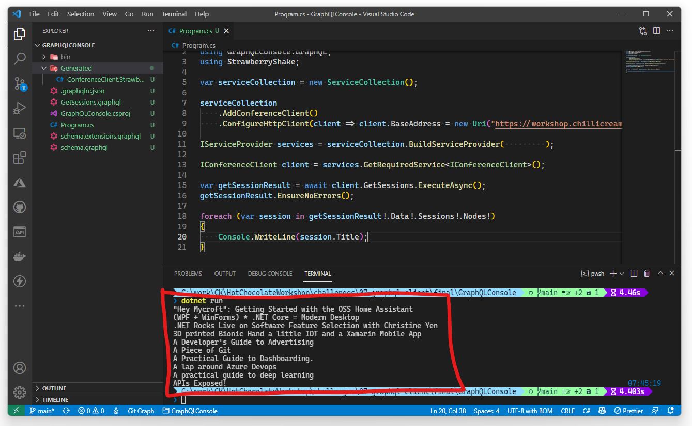
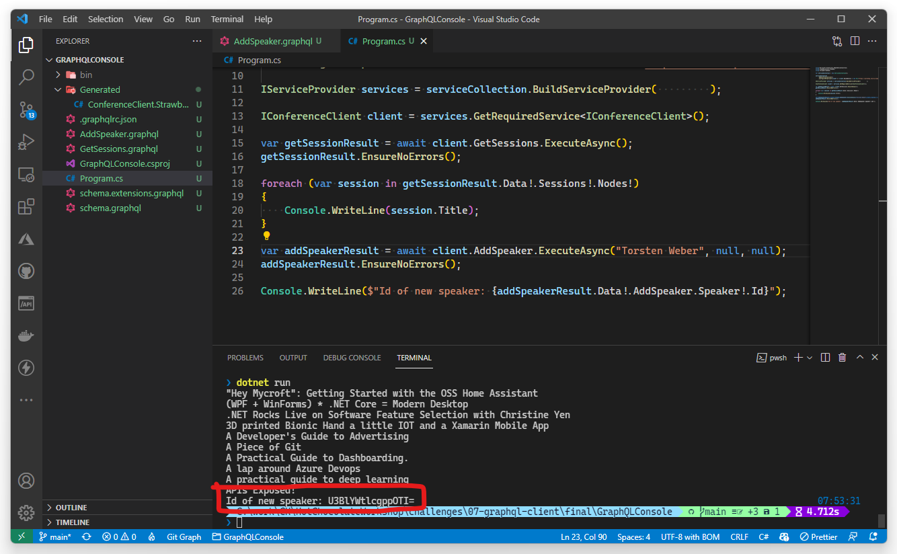

In this tutorial we will walk you through the basics of adding a Strawberry Shake GraphQL client to a console project. For this example we will create a simple console application and fetch some simple data from our demo backend.

Strawberry Shake is not limited to console application and can be used with any .NET standard compliant library.

In this tutorial, we will teach you:

- How to add the Strawberry Shake CLI tools.
- How to generate source code from .graphql files, that contain operations.
- How to use the generated client in a classical or reactive way.
- How to disable state management for ASP.NET Core use-cases.

## Step 1: Add the Strawberry Shake CLI tools

The Strawberry Shake tool will help you to setup your project to create a GraphQL client.

Open your preferred terminal and select a directory where you want to add the code of this tutorial.

1. Create a dotnet tool-manifest.

   ```bash
   dotnet new tool-manifest
   ```

2. Install the Strawberry Shake tools.

   ```bash
   dotnet tool install StrawberryShake.Tools --local
   ```

## Step 2: Create a console project

Next, we will create our console project so that we have a little playground.

1. First, a new solution called `GraphQLConsole.sln`.

   ```bash
   dotnet new sln -n GraphQLConsole
   ```

2. Create a new console application.

   ```bash
   dotnet new console -n GraphQLConsole
   ```

3. Add the project to the solution `GraphQLConsole.sln`.

   ```bash
   dotnet sln add ./GraphQLConsole
   ```

## Step 3: Install the required packages

Strawberry Shake supports multiple GraphQL transport protocols. In this example we will use the standard GraphQL over HTTP protocol to interact with our GraphQL server.

1. Add the `StrawberryShake.Transport.Http` package to your project.

   ```bash
   dotnet add GraphQLConsole package StrawberryShake.Transport.Http
   ```

2. Add the `StrawberryShake.CodeGeneration.CSharp.Analyzers` package to your project in order to add our code generation.

   ```bash
   dotnet add GraphQLConsole package StrawberryShake.CodeGeneration.CSharp.Analyzers
   ```

When using the HTTP protocol we also need the HttpClientFactory and the Microsoft dependency injection.

3. Add the `Microsoft.Extensions.DependencyInjection` package to your project.

   ```bash
   dotnet add GraphQLConsole package Microsoft.Extensions.DependencyInjection
   ```

4. Add the `Microsoft.Extensions.Http` package to your project.

   ```bash
   dotnet add GraphQLConsole package Microsoft.Extensions.Http
   ```

## Step 4: Add a GraphQL client to your project using the CLI tools

To add a client to your project, you need to run the `dotnet graphql init {{ServerUrl}} -n {{ClientName}}`.

In this tutorial we will use our GraphQL workshop to create a list of sessions that we will add to our console application.

> Though we could query our own GraphQL server we've created in the previous challenges, we'll use the server hosted by the ChilliCream team hosted at https://workshop.chillicream.com/graphql. That way you don't have to keep your server running.

1. Add the conference client to your console application.

   ```bash
   dotnet graphql init https://workshop.chillicream.com/graphql/ -n ConferenceClient -p ./GraphQLConsole
   ```

2. Customize the namespace of the generated client to be `GraphQLConsole.GraphQL`. For this head over to the `.graphqlrc.json` and insert a `namespace` property to the `StrawberryShake` section.

   ```json
   {
     "schema": "schema.graphql",
     "documents": "**/*.graphql",
     "extensions": {
       "strawberryShake": {
         "name": "ConferenceClient",
         "namespace": "GraphQLConsole.GraphQL",
         "url": "https://workshop.chillicream.com/graphql/",
         "dependencyInjection": true
       }
     }
   }
   ```

Now that everything is in place let us write our first query to ask for a list of session titles of the conference API.

3. Choose your favorite IDE and the solution. If your are using VSCode do the following:

   ```bash
   code ./GraphQLConsole
   ```

4. Create new query file `GetSessions.graphql` with the following content:

   ```graphql
   query GetSessions {
     sessions(order: { title: ASC }) {
       nodes {
         title
       }
     }
   }
   ```

   > If you're using Visual Studio, it may add an `ItemGroup` in your `.csproj` file excluding your newly created `*.graphql` file. In that case, delete the corresponding section from the project file:
   > ```diff
   > - <ItemGroup>
   > -   <GraphQL Remove="GetSessions.graphql" />
   > - </ItemGroup>
   > ```

5. Compile your project.

   ```bash
   dotnet build
   ```

With the project compiled you now should see a directory `Generated`. The generated code is just there for the IDE, the actual code was injected directly into roslyn through source generators.



1. Head over to the `Program.cs` and add the new `ConferenceClient` to the dependency injection.

   > In some IDEs it is still necessary to reload the project after the code was generated to update the IntelliSense. So, if you have any issues in the next step with IntelliSense just reload the project and everything should be fine.

   ```csharp
   using Microsoft.Extensions.DependencyInjection;
   using GraphQLConsole.GraphQL;

   var serviceCollection = new ServiceCollection();

   serviceCollection
       .AddConferenceClient()
       .ConfigureHttpClient(client => client.BaseAddress = new Uri("https://workshop.chillicream.com/graphql")   );

   IServiceProvider services = serviceCollection.BuildServiceProvider(         );

   IConferenceClient client = services.GetRequiredService<IConferenceClient>();
   ```

## Step 5: Use the ConferenceClient to perform a simple fetch

In this section we will perform a simple fetch with our `ConferenceClient` and output the result to the console.

1. Head over to `Program.cs`.

2. Replace the existing content with following code to execute the `GetSessions` query.

   ```csharp
   using Microsoft.Extensions.DependencyInjection;
   using GraphQLConsole.GraphQL;
   using StrawberryShake;

   var serviceCollection = new ServiceCollection();
   
   serviceCollection
       .AddConferenceClient()
       .ConfigureHttpClient(client => client.BaseAddress = new Uri("https://workshop.chillicream.com/graphql"));
   
   IServiceProvider services = serviceCollection.BuildServiceProvider();
   
   IConferenceClient client = services.GetRequiredService<IConferenceClient>();
   
   var getSessionResult = await client.GetSessions.ExecuteAsync();
   getSessionResult.EnsureNoErrors();
   
   foreach (var session in getSessionResult.Data!.Sessions!.Nodes!)
   {
       Console.WriteLine(session.Title);
   }
   ```

3. Start the console application with `dotnet run --project ./GraphQLConsole` and see if your code works.



## Step 6: Add a mutation to the ConferenceClient

1. Create new file `AddSpeaker.graphql` with the following content:

   ```graphql
   mutation AddSpeaker($name: String!, $bio: String, $webSite: String) {
     addSpeaker(input: { name: $name, bio: $bio, webSite: $webSite }) {
       speaker {
         id
       }
     }
   }
   ```

2. Compile your project so the code for new mutation gets generated.

   ```bash
   dotnet build
   ```

3. Add a call the newly generated mutation.

   ```csharp
   var addSpeakerResult = await client.AddSpeaker.ExecuteAsync("Torsten Weber", null, null);
   addSpeakerResult.EnsureNoErrors();

   Console.WriteLine($"Id of new speaker: {addSpeakerResult.Data!.AddSpeaker!.Speaker!.Id}");
   ```

4. Start the console application with `dotnet run --project ./GraphQLConsole` and see if your code works.


